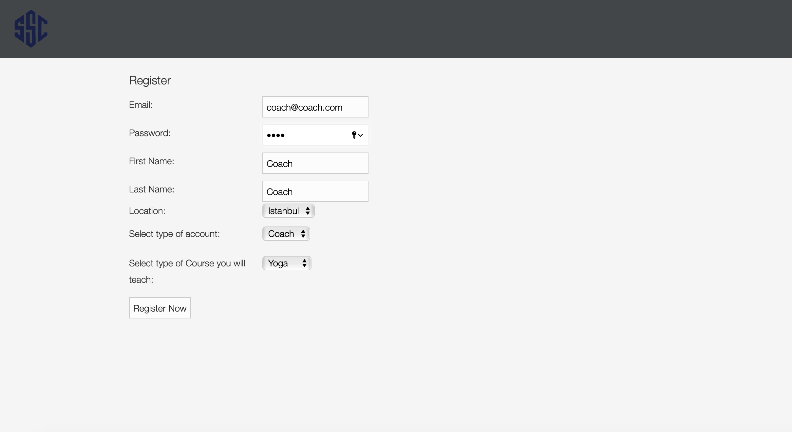

# MySomertonProject-BugrahanSenturk

## Versions

> | Grails Version: 4.0.12
| JVM Version: 15.0.1
| distributionUrl=https\://services.gradle.org/distributions/gradle-6.3-bin.zip 

**Plugins:**

>| com.github.agorapulse.grails-aws-sdk:aws-sdk-s3:2.4.14 

### Install Plugins:

In Build.gradle:

```java
repositories {
    maven { url 'https://jitpack.io' }
    maven { url "https://repo.grails.org/grails/core" }
}

dependencies {
		compile 'com.github.agorapulse.grails-aws-sdk:aws-sdk-s3:2.4.14'
}
```

After loading Plugin you need to implement S3 access and secret key's to application.yml file.

In conf/application.yml:

```java
grails:
    plugin:
            awssdk:
                accessKey: {ACCESS-KEY}
                secretKey: {SECRET-KEY}
                region: eu-central-1  
                s3:
                    bucket: bugrahandeveloperproject
```

> Please use accessKey and secretKey that provided you by email.
> 

After that application is ready to run.

In Terminal:

```bash
$grails

grails> run-app
```

[Cases & Assumptions](https://www.notion.so/15efe86915d9419fbbe11601944921a0)

---

## Database Model:


# User Test

## Login as client:

After enter e-mail and password users are able to login.


Clients list all the Available Sessions.


Clients can Filter Sessions by Location and/or Sport in index page using Dropdown menu and filter button:


---

## Login as Coach:


Coaches see only their sessions. They see both available and unavailable sessions and can edit them.


Coaches Create new sessions from index page using inputs and dropdown menus. (program gets Session's sport type directly from User's attributes.)


---

## Register a Client or Coach

Users register from that page as Coach or Client. If user selects "coach" as account type  a new dropdown will open to get user's sport.


---




---

## Edit Sessions:

After clicking Session's title in index page;

You can upload a new image to AWS S3 with Select File and Upload buttons.


### Edit Attributes

You can edit Title, Location and Availibility of a session using dropdown menus and "Edit" button.


## Edit User

After clicking Edit User button in index page;

You can change profile Picture and Location.


## Attend to Session as client:

As a client, you can see all available sessions and with clicking the title;

You can see details about session and Attend Session . 


Session's Quota was 1 so when client attend to session, It becomes unavailable and non of clients show the session.


Let's check a group session:


